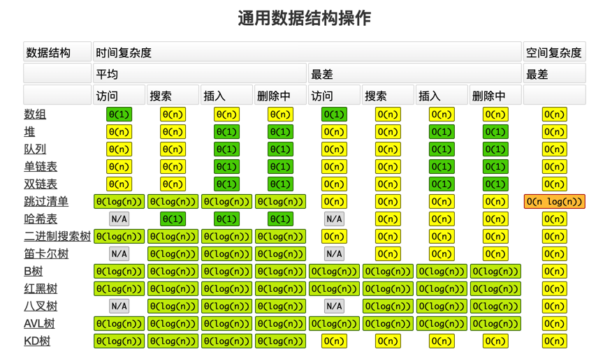
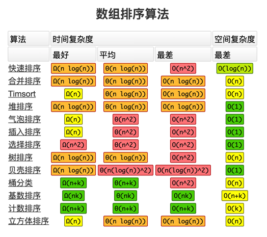

# LeetCode
LeetCode 刷题仓库

## 五步刷题法:

### 刷题第一遍:

- 5分钟:读题 + 思考
- 如果没思路 直接看解法:注意!多解法，比较解法优劣 
- 背诵、默写好的解法 

### 刷题第二遍:

- 马上自己写 —> LeetCode 提交 
- 多种解法比较、体会 —> 优化 

### 刷题第三遍 

- 过了一天后，再重复做题

- 不同解法的熟练程度 —> 专项练习 

### 刷题第四遍 

- 过了一周:反复回来练习相同题目 

### 刷题第五遍 

- 面试前一周恢复性训练 

